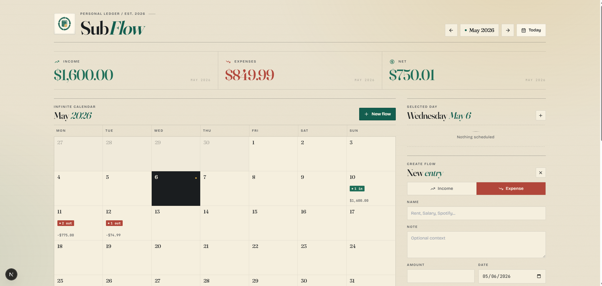
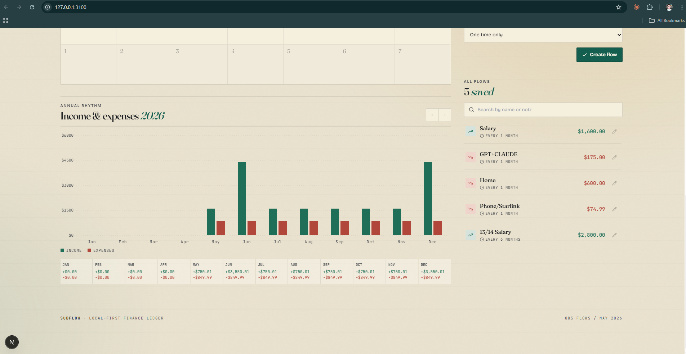

# SubFlow

**Support / donation:** [revolut.me/jumpino](https://revolut.me/jumpino)

SubFlow is a simple local-first app for tracking your incomes and expenses without needing an online account, cloud setup, or anything complicated. You open it, add what comes in, add what goes out, and the calendar + yearly graph show you what is happening with your money.

It is made for people who just want something friendly and quick: salary, rent, subscriptions, one-time payments, monthly repeats, and a clear overview of how much was saved or spent each month.





## What It Does

- Track incomes and expenses
- Add one-time flows or repeating flows every 1 to 12 months
- Click a calendar day and create a flow directly for that date
- Edit or delete existing flows
- See daily, monthly, and yearly totals
- Keep everything local in a `.db` file inside the project
- Avoid pushing local database files to GitHub

## Quick Start

### Windows

Double-click:

```bat
install-windows.bat
```

This installs/repairs dependencies, creates `start.bat`, and also creates a desktop shortcut called **Sub Flow** with the app logo.

After that, just double-click:

```bat
start.bat
```

or use the **Sub Flow** desktop shortcut.

### macOS / Linux

Run this once:

```sh
chmod +x install-unix.sh start.sh
./install-unix.sh
```

Then start the app with:

```sh
./start.sh
```

## App URL

When started, SubFlow runs here:

```text
http://127.0.0.1:3100
```

## Local Data

SubFlow stores its data locally in a database file inside the project. The `.gitignore` is set up so local `.db` files are not pushed to GitHub.

That means your finance data stays on your machine.

